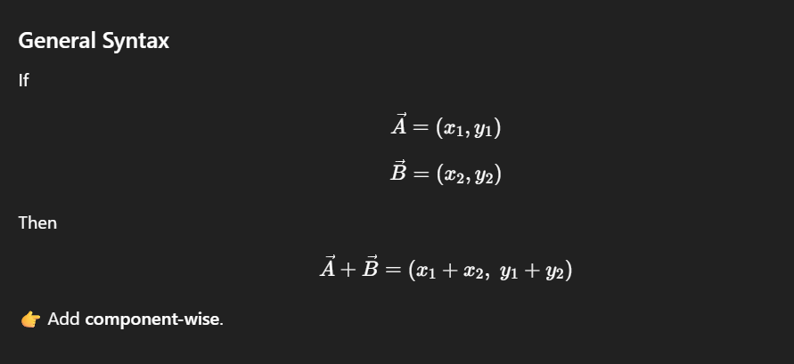

### What it means 

**Vector addition = combining movements.**

If you move:

- **x units in one direction**, and then
- **y units in another direction**,

the final position is found by **adding the vectors**.

---

---

## Cardinal System (X–Y Plane intuition)

Think of a **map**:

- **+x** → move right (East)
- **–x** → move left (West)
- **+y** → move up (North)
- **–y** → move down (South)

---

## Example: Moving a Point

Start at origin:

```
(0, 0)

```

Move:

- 3 units right → `(3, 0)`
- 4 units up → `(0, 4)`

Vector addition:

```
(3, 0) + (0, 4) = (3, 4)

```

📍 Final position: **(3, 4)**

---

## Real-world Interpretation

> “Walk 3 steps east, then 4 steps north.”
> 

Vector addition tells you **where you end up**, not how you walked.

---

## In ML / Data Context

If:

- Vector = feature values
- Vector addition = combining effects

Example:

```
User profile vector + bias vector = adjusted input

```

---

## One-line takeaway 

> Vector addition means adding movements along each axis to get a final position.
>