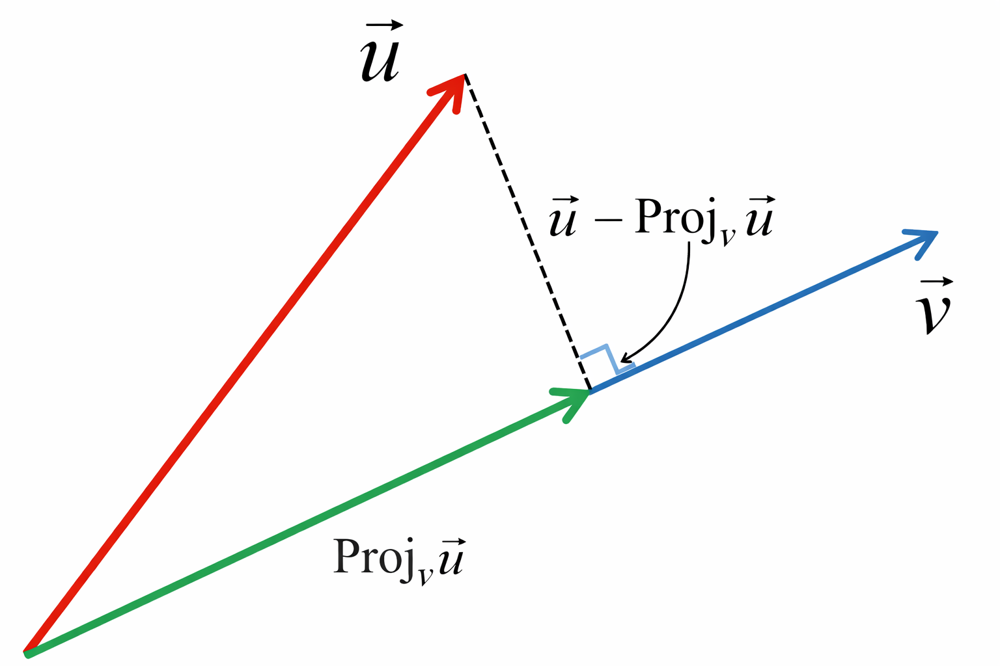

## 1What is projection? 

**Projection = how much of one vector lies along another vector.**

* You have a vector **x**
* You have a direction (line) **L**
* Projection tells you:
  👉 *“If x slides onto L, how much of x stays on L?”*

That “stayed part” is the **projection of x on L**.

---

## Notation & how to read it

* **Projection of x on L** is written as:

$$
\text{proj}_L(x)
$$

Read it as:
👉 **“projection of x onto L”**

---

## Geometric idea (what your graph shows)

* Draw vector **x**
* Draw line **L**
* Drop a **perpendicular** from the tip of **x** to line **L**
* The part **along L** is the projection
* The leftover part is **perpendicular to L**

So:

$$
x = \text{proj}_L(x) + \text{(perpendicular part)}
$$

---

## Key perpendicular fact (VERY IMPORTANT)

If two vectors are perpendicular:

$$
a \cdot b = 0
$$

Here:

* $x - \text{proj}_L(x)$ is perpendicular to **L**

So:

$$
(x - \text{proj}_L(x)) \cdot L = 0
$$

---

## Derivation (clean & minimal)

Assume projection lies along **L**, so it must be some scalar multiple:

$$
\text{proj}_L(x) = cL
$$

Plug into perpendicular condition:

$$
(x - cL)\cdot L = 0
$$

$$
x\cdot L - c(L\cdot L) = 0
$$

Solve for **c**:

$$
c = \frac{x\cdot L}{L\cdot L}
$$

---

## Final formula (MEMORIZE THIS)

$$
\boxed{
\text{proj}_L(x) = \frac{x\cdot L}{L\cdot L};L
}
$$

That’s it.
No magic. No extra steps.

---

## If L is a unit vector (shortcut)

If $|L| = 1$, then $L\cdot L = 1$

So:

$$
\text{proj}_L(x) = (x\cdot L),L
$$

This is used **everywhere**.

---

## What is the remaining part?

The leftover vector is:

$$
\boxed{
x - \text{proj}_L(x)
}
$$

This part is **orthogonal (perpendicular)** to **L**.

---

## Why projection matters (REAL use cases)

### 🔹 Machine Learning (VERY IMPORTANT)

#### 1. **Linear Regression**

* Prediction = projection of data onto feature space
* Least squares = projecting y onto column space of X

👉 Regression is literally **projection in high dimensions**

---

#### 2. **Gradient Descent**

* Removing components of gradients
* Orthogonal decomposition of updates

---

#### 3. **PCA (Principal Component Analysis)**

* Data is projected onto principal directions
* Dimensionality reduction = projection

---

#### 4. **Cosine Similarity**

* Projection normalized by magnitude
* Used in NLP, embeddings, vector databases

---

#### 5. **Orthogonalization (Gram–Schmidt)**

* Remove projections step-by-step
* Basis construction

---

## One-line intuition (remember this)

> **Projection answers:
> “How much of vector x points in the direction of L?”**

