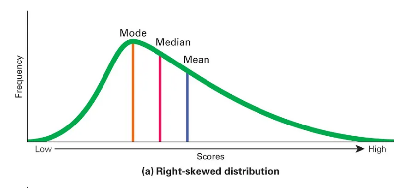
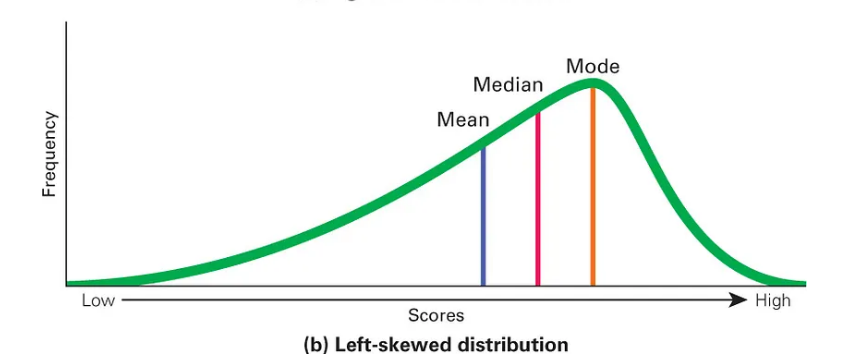

# 📊 Histogram

## What is a Histogram?

A **histogram** is a graphical representation of **quantitative (numerical) data**.

It helps visualize:

* **Shape** of the data
* **Central tendency** (where data is centered)
* **Variability / spread**
* **Skewness & outliers**

👉 It is one of the **first plots you should draw in ML**.

---

## What Kind of Data Uses Histogram?

* **Continuous data**
* Data values lie within **ranges**
* Minimal or no gaps between values

Examples:

* Height, weight, age, time, income

---

## How a Histogram is Constructed

1. Take a dataset
2. Divide the data range into **bins (intervals)**
3. Plot:

   * **X-axis** → bins (ranges)
   * **Y-axis** → frequency (count)

---

## Role of Bins (Very Important)

* **Fewer bins**

  * Histogram looks **compact**
  * Less detail
* **More bins**

  * More detail
  * Can look noisy

👉 Bin size controls **resolution vs noise tradeoff**

---

## Histogram vs Probability Distribution

* Histogram = **empirical frequency**
* Smooth curve over histogram = **probability distribution**
  (normal, exponential, etc.)

👉 In ML:

* Histogram → data reality
* Distribution → modeling assumption

We study distributions **after** seeing histograms.

---

# 📉 Skewness

## What is Skewness?

**Skewness** describes the **asymmetry** of a distribution.

Plain English:

> It tells which side of the data has a **longer tail**

---

## 1️⃣ Symmetric Distribution

### Characteristics

* Left and right sides are mirror images
* No skew

### Mean–Median–Mode Relationship

$$
\text{Mean} = \text{Median} = \text{Mode}
$$

---

## 2️⃣ Positively Skewed (Right Skewed)

### Characteristics

* Long tail on the **right**
* Most data on the **left**
* Caused by **large outliers**

Examples:

* Income
* House prices
* Time to finish tasks

### Mean–Median–Mode Relationship

$$
\text{Mode} < \text{Median} < \text{Mean}
$$

---

## Negatively Skewed (Left Skewed)

### Characteristics

* Long tail on the **left**
* Most data on the **right**
* Caused by **small extreme values**

Examples:

* Easy exam scores
* Age at retirement

### Mean–Median–Mode Relationship

$$
\text{Mean} < \text{Median} < \text{Mode}
$$

---

## Why Skewness Matters in ML 

* Mean becomes **misleading**
* Variance inflates
* Many ML models **assume symmetry**
* Feature transformations are required
---

