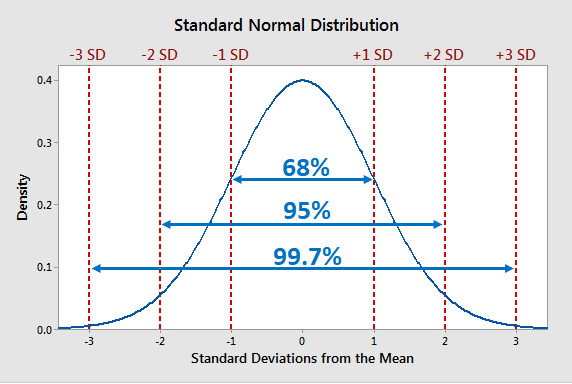
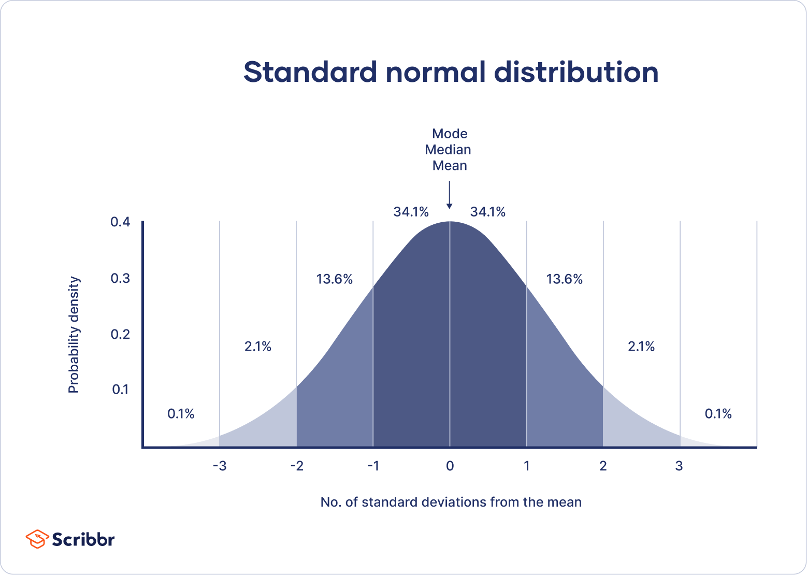

# Understanding the meaning

## Normal (Gaussian) Distribution — What it *actually* is and why it exists

### The real-world problem it solves

In real life, most things don’t spread randomly. They tend to **cluster around an average**.

Think about:

* Heights of people in a city
* Exam scores of a big class
* Measurement errors in sensors
* Reaction time of humans

You don’t see values equally everywhere. You usually see:

👉 Many values near the middle
👉 Few extreme values on either side

The normal distribution is basically a **mathematical model for “natural variation around an average.”**

It answers questions like:

* “How common is a certain value?”
* “Is this observation normal or rare?”
* “How much spread exists around the average?”

So instead of listing millions of data points, we describe the entire behavior with one smooth curve.

---

## What it *means* intuitively

Imagine throwing darts at a target.

* Most darts land near the center.
* Some land slightly far.
* Very few land extremely far.

That pattern center heavy, symmetric, smooth is what a Gaussian distribution captures.

Key intuition:

👉 It describes **random processes where small influences add up together**.

Example:

Your exam score isn’t caused by one factor — it’s sleep + preparation + stress + luck + environment.
When many small factors combine, the result often becomes Gaussian.

---

## Real-world examples you already know

### Human height

Most men might be around ~170 cm.
Very few are 140 cm or 210 cm.

### Errors in experiments

If you repeat an experiment many times, the average error often looks Gaussian.

---

## What the bell shape is telling you

That famous bell curve is not decoration. Each part means something:

* Middle peak → Most common values
* Left side → Lower than average values
* Right side → Higher than average values
* Symmetry → No bias toward one direction

If a dataset looks like this, it’s often “well-behaved” statistically.

---

# Core Idea and Probability Meaning

## Core Idea 

Forget formulas for a minute. The Gaussian curve is basically controlled by only **two knobs**:

### Mean (μ) — the center

This is simply the average.

* Move the mean → the whole curve slides left or right.
* Shape doesn’t change, only location changes.

Example:

* Avg exam score = 60 → peak at 60
* Avg exam score = 80 → same shape, peak shifts to 80

👉 Mean answers: **“Where is the middle?”**

---

### Variance / Standard Deviation (σ) — the spread

This controls how wide or tight the curve looks.

* Small σ → narrow, tall curve (data tightly packed)
* Large σ → wide, flat curve (data scattered)

Example:

* If everyone scores between 58–62 → small deviation
* If scores range from 20–95 → large deviation

👉 Standard deviation answers: **“How much do values fluctuate?”**

---

## Probability Meaning — what the curve actually represents

👉 The height of the curve is **NOT** probability.

The **area under the curve** is probability.

Think of the curve like a smooth mountain:

* A single exact value has almost zero probability.
* A *range* of values has meaningful probability.

Example:
Instead of asking:

“What is probability of height = 170.000000 cm?”
We ask:

“What is probability of height between 165 and 175?”

That shaded region under the curve = probability.

---

### The famous 68–95–99.7 rule (super important)



For a normal distribution:

* ~68% of data lies within **±1 standard deviation**
* ~95% within **±2 standard deviations**
* ~99.7% within **±3 standard deviations**

No heavy math — just an empirical truth of the bell curve.

This is insanely useful because it lets you judge rarity fast:

* Within 1σ → normal
* Beyond 2σ → unusual
* Beyond 3σ → rare/outlier territory

---

# Mathematical Understanding

The Gaussian distribution is defined by a **probability density function (PDF)**:

$$
f(x) = \frac{1}{\sigma \sqrt{2\pi}} ;
e^{-\frac{(x-\mu)^2}{2\sigma^2}}
$$

---

## 👉 What is the **input**?

**x** = any value from your data.

Examples:

* height = 170
* exam score = 82
* model error = -1.5

You give the function a value `x`.

---

## 👉 What is the **output**?

The output is:

👉 **probability density** (not direct probability).

It tells you:

> “How dense or likely is the region around this value?”

Higher output → region more common
Lower output → region rarer

---

## honest interpretation of parts of formula

### (x − μ)

Distance from the mean.

* If x is near μ → exponent small → value high.
* If x far from μ → exponent large negative → value tiny.

So the function automatically punishes values far from center.

---

### σ (standard deviation)

Controls spread.

* Bigger σ → denominator bigger → curve flatter.
* Smaller σ → curve sharper.

---

### e^(…)

This exponential is why the curve smoothly drops off.
Not linear, not abrupt smooth decay.

---

### 1 / (σ√2π)

This is just a **normalization constant**.

Its job:

👉 Make total area under curve = 1
Because total probability must be 100%.

---

# If you graph it — what are the axes?



## X-axis

Actual values of the variable.

Examples:

* Heights (150, 160, 170…)
* Errors (-3, -2, -1, 0, 1…)
* Scores

So x-axis = **real-world measurement values**.

---

## Y-axis

Y-axis is:

👉 **Probability Density** (PDF value)

NOT probability itself.

Important:

* Y value can be greater than 1 sometimes.
* That’s allowed because area = probability, not height.

---

# How to read the graph properly (real sequence)

### Step 1 — Look at center (μ)

Peak occurs exactly at mean.

This tells you where data concentrates.

---

### Step 2 — Look at width (σ)

Wide curve → high variability
Narrow curve → consistent data

---

### Step 3 — Don’t read probability from height

Instead:

👉 Probability = **area between two x values**

Example:

* Area between 60 and 70 = probability score lies there.

---

### Step 4 — Symmetry check

Left side mirrors right side.

So:

P(x < μ − k) = P(x > μ + k)

---
# Mean, Median, Mode, Variance & Standard Deviation in Normal Distribution


## Mean (μ) — the center of the distribution

### Formula (continuous case)

$$
\mu = \int_{-\infty}^{\infty} x , f(x), dx
$$

### 👉 What it means here

Mean is the **balance point** of the curve.

For a normal distribution:

```
mean = median = mode
```

All three sit exactly at the center because the curve is perfectly symmetric.

So if:

```
μ = 50
```

Peak of bell curve is at x = 50.

---

## median — the 50% split point

### Definition

Median is the value where:

```
P(X ≤ median) = 0.5
```

Half area left, half area right.

### 👉 In Gaussian:

Because of symmetry:

```
median = μ
```

No separate calculation needed.

---

## Mode — the highest peak

### Definition

Mode = value where PDF is maximum.

Mathematically:

$$
\text{mode} = \arg\max_x f(x)
$$

For Gaussian, the peak occurs when:

```
x = μ
```

So again:

```
mode = μ
```
---

## Variance (σ²) — spread of the distribution

Variance measures how far values spread from mean.

### Formula

$$
\sigma^2 = \int_{-\infty}^{\infty} (x-\mu)^2 , f(x), dx
$$

Interpretation:

* Take distance from mean
* Square it (avoid negatives)
* Weight by density
* Average it

---

## 👉 Meaning inside Gaussian

Variance controls width:

* Small σ² → narrow bell
* Large σ² → wide bell

Nothing else changes — just spread.

---

## Standard Deviation (σ)

Standard deviation is simply:

$$
\sigma = \sqrt{\sigma^2}
$$

Why take square root?

Because variance is in squared units.

Example:

* variance in (cm²)
* std deviation back to cm

So σ gives intuitive scale.

---

