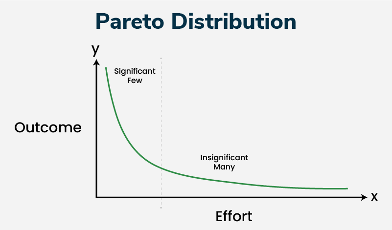

# Pareto Distribution




---

## What it means in general (plain-English idea)

Pareto distribution describes situations where:

👉 A small number of things account for most of the impact.

It’s basically the math behind:

* Wealth inequality
* Viral content
* Heavy internet users
* Popular products dominating sales

Key intuition:

* Most observations are small.
* Few observations are extremely large.
* Extremes are not accidents — they’re expected.

So it models **imbalanced systems**.

---

## Meaning in statistics (what statisticians think)

In statistics, Pareto is a **continuous probability distribution** used for heavy-tailed data.

What makes it special:

* There is a **minimum value** (nothing exists below it).
* Probability decreases as values grow.
* The tail is long → extreme values remain possible.

Statistically, it’s used when:

* Mean can be unstable
* Variance can explode
* Outliers actually carry real information

So unlike normal distribution:

👉 The tail is the main story, not noise.

---

##  Parameters — what we give as input & what output we expect

## The basic function (for reference)

$$
f(x)=\frac{\alpha x_m^{\alpha}}{x^{\alpha+1}}, \quad x \ge x_m
$$

Don’t worry about memorizing — focus on meaning.

---

## ✅ Inputs / Parameters

There are **three things** to think about.

---

### 👉 `x` — the value you test

This is the variable.

Examples:

* income level
* followers count
* file size
* city population

You plug a value into the function.

Question you’re asking:

> “How likely is this size?”

---

### 👉 `xₘ` (minimum or scale parameter)

This is the starting point.

Nothing exists below this threshold.

Examples:

* Only modeling income above ₹50k
* Only analyzing files bigger than 1MB

Why needed?

Because Pareto models **tail behavior**, not the tiny values.

---

### 👉 `α` (alpha — shape parameter)

This controls steepness.

Brutally important:

* Small α → heavier tail → more extreme values
* Large α → faster decay → extremes rare

---

## Output of the function

The function returns:

👉 Probability density (how common that value is).

Higher output:

* many observations around that size.

Lower output:

* rare large values.

Important:

It doesn’t give a single prediction.
It gives a **pattern of likelihood** across sizes.

---

## Moving to the graph — axes and interpretation

## 📉 Axes

### X-axis:

```
value (x)
```

Examples:

* income
* followers
* size
* rank

It moves from small → huge.

---

### Y-axis:

```
probability density  f(x)
```

Meaning:

How frequently values of size x appear.

High Y → common
Low Y → rare

---

