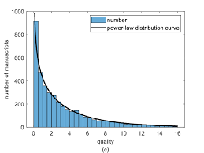
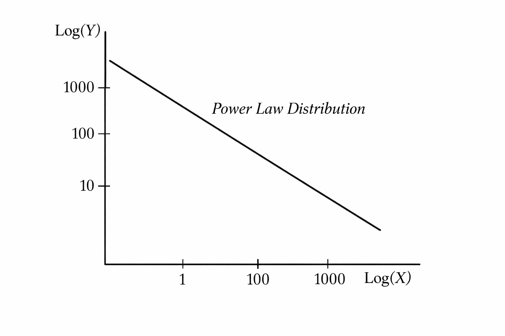

# Power Law Distribution — what it *really* is

A **power law distribution** shows up when **a tiny number of things dominate everything**, while most things stay small or rare.

It describes systems where:

👉 A few items are insanely big
👉 Most items are tiny
👉 There’s no clean “average” that represents reality

This is NOT like the bell curve where values cluster around the middle. Power laws are all about **extreme imbalance**.

---

## What problem does it solve?

Normal distributions assume the world is balanced around an average.

But real life often isn’t.

Some examples:

* Social media → a few posts get millions of views, most get none.
* Wealth → a few people hold huge wealth, most don’t.
* Internet traffic → a few websites get massive traffic.
* Coding bugs → a few files contain most issues.

If you try to model these using normal distribution, you get garbage intuition because:

The “average” lies to you
Rare huge events matter more than common small ones

Power law helps explain:

* Why extremes happen more often than you expect.
* Why scaling systems becomes tricky (small changes can explode).
* Why optimization focuses on top contributors.

---

## Where you’ll actually see it in the real world

You’ll notice power laws everywhere once you start looking:

* Followers on Instagram/X
* Word frequency in language (few words used constantly)
* Earthquake sizes
* File sizes on servers
* City populations
* Open-source repo popularity

It often emerges from **rich-get-richer systems**:
The more something grows, the easier it grows further.

---

# How you actually *use* a Power Law Distribution


## What is the **input**?

You don’t feed a “formula” first.
You start with **real-world measurements** that look extremely imbalanced.

Typical inputs:

* Number of followers per account
* Views per video
* Frequency of words in text
* Repo stars on GitHub
* Wealth per person
* City population sizes

So your raw input is basically:

👉 A list of values where **few numbers are huge and most are tiny**.

Example input data:

```
[1, 1, 2, 3, 3, 5, 8, 50, 1000]
```

That long gap? That’s the signal.

---

## What is the **output**?

You’re usually trying to understand:

* Probability of seeing a certain size
* Frequency vs size relationship
* How fast things decay as they grow

Output often looks like:

👉 “How likely is value X?”
👉 “How many items exist at size X?”

So instead of a single prediction, power law gives you a **pattern of scaling**.

---

## How the graph looks (this is the key part)

There are **two ways** people plot it — and beginners get confused here.

---

## Normal scale plot



### Axes:

* **X-axis:** Size or magnitude (followers, views, population)
* **Y-axis:** Frequency or probability

### Shape:

* Starts very high on the left
* Drops fast
* Then stretches into a *long tail*

It looks like a steep cliff that slowly flattens.

Meaning:

👉 Small values happen A LOT
👉 Huge values exist but are rare

---

## Log–Log plot 



Here’s the trick most people miss.

If you take:

* log(X)
* log(Y)

and plot again…

👉 A true power law becomes almost a **straight line**.

That’s how statisticians verify power-law behavior.

So:

* X-axis → log(size)
* Y-axis → log(frequency)

Straight line = scaling pattern exists.

---

## How to interpret a single point on the graph

Suppose a point sits at:

```
X = 1,000 followers
Y = 10 users
```

Interpretation:

👉 Only 10 users have ~1000 followers.

Another point:

```
X = 10 followers
Y = 10,000 users
```

Meaning:

👉 Tons of small accounts exist.

Each point basically answers:

> “How common is this size?”

---

## What the **shape** represents 

This curve tells you something powerful:

### The system is NOT balanced.

Growth is uneven.

When the line slopes downward:

* Bigger things exist less often.
* But they never fully disappear.

That long tail means:

👉 Extreme events are not accidents — they’re built into the system.

This is why:

* Viral videos exist.
* Billion-dollar startups exist.
* Mega-influencers exist.

---

# Power Law — now the math 


## What the function represents

A power-law function describes:

> “How probability changes when size increases.”

In simple words:

👉 Bigger values become less likely
👉 But they never become zero

So the function tells you:

* If I pick a value **x**, how likely is it?

---

## The basic formula

The most common form you’ll see is:

$$
P(x) = C \cdot x^{-\alpha}
$$

---

## What is the **input**?

### 👉 `x`

This is just the **size** or **magnitude**.

Examples:

* Number of followers
* File size
* City population
* Word frequency rank

So when you give:

```
x = 10
```

you are asking:

👉 “What’s the probability of seeing size 10?”

---

## What is the **output**?

### 👉 `P(x)`

This gives:

👉 Probability (or density) of observing that size.

Important truth:

This is NOT predicting one exact outcome.

It tells you:

> How common or rare values of this size are.

Higher output → more common
Lower output → rarer

---

## Meaning of each term in the formula

## `x`

The value you plug in.

Think: magnitude or scale.

As x grows bigger → probability drops.

---

## `α` (alpha) — the most important part

This is called the **power-law exponent**.

It controls **how fast the curve falls**.

* Small α → slow drop → more extreme events
* Large α → fast drop → fewer extremes
---

## `C` — the scaling constant

This just keeps total probability valid.

Without it, probabilities won’t add up to 1.

You usually don’t worry about C unless doing strict math.

It’s just a normalization factor.

---


## What the graph axes actually mean

## Normal plot

* **X-axis:** value (x)
* **Y-axis:** probability P(x)

Shape:

* Starts high
* Drops sharply
* Long flat tail

Meaning:

Small things dominate counts.
Huge things exist but are rare.

---

## Log–Log plot (important)

If you plot:

```
log(x) vs log(P(x))
```

The equation becomes:

$$
\log P(x) = \log C - \alpha \log x
$$

Which is literally a straight line:

```
y = mx + b
```

Where:

* slope = −α
* intercept = log C

This is why power laws are easy to detect visually.

---
